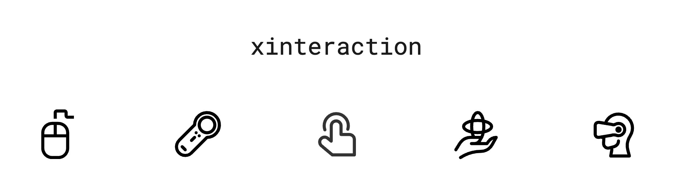

_**interaction** on the 3D web for any (**x**) input device_

---

**xinteraction** translates events from input devices (e.g., Mouse, 6DOF Controller, Hand) into events on 3D Objects in a Three.js Scene.

**xinteraction** can be combined with "TBD" for **WebXR** use cases.

[⤷ Getting start with **xinteraction** + **TBD**]()

---

## [Documentation](https://coconut-xr.github.io/xinteraction)

* [Introduction](https://coconut-xr.github.io/xinteraction/#/introduction.md) Explains the xinteraction concept and use
* [Pointing Input Devices](https://coconut-xr.github.io/xinteraction/#/pointing.md) Explains pointing interactions based straight rays
* [Curved Pointing Input Devices](https://coconut-xr.github.io/xinteraction/#/curved.md) Explains interactions using a curved line
* [Distance Based Input Device](https://coconut-xr.github.io/xinteraction/#/distance.md) Explains interactions like touching or grabbing
* [Event Capture](https://coconut-xr.github.io/xinteraction/#/event-capture.md) Explains event capture for dragging