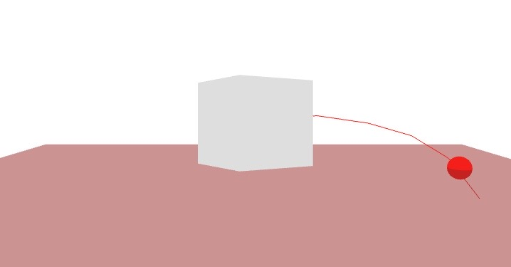

# Curved Pointer

The following example shows how a pointer can be created based on a list of points, defining a curved line. The `XCurvedPointer` component works similarly to the `XStraightPointer` component but requires a `points` parameter. We illustrate how a teleportation interaction with a cursor can be implemented. The `Ground` component implements `onPointerEnter`, `onPointerMove`, and `onPointerLeave` events, which use the intersection `point` to position a cursor (red sphere). The `XCurvedPointer` can also be used to create pointers with a limited length and even allows to change the points at runtime for a dynamic curve.

_In some cases it might be necassary/convenient to provide a initial set of pressed elements. This can be achieved by assigning a array of element ids to 'initialPressedElementIds'._

[CodeSandbox](https://codesandbox.io/s/xinteraction-curved-pointer-tdmnjv?file=/src/app.tsx)



```tsx
import { Canvas, useFrame } from "@react-three/fiber";
import {
  InputDeviceFunctions,
  XCurvedPointer,
  noEvents,
} from "@coconut-xr/xinteraction/react";
import { useRef } from "react";
import { BufferGeometry, Mesh, Vector3, Vector3Tuple } from "three";

export default function App() {
  return (
    <Canvas events={noEvents}>
      <Ground />
      <RotatingCurvedPointer id={-1} />
    </Canvas>
  );
}

const curvedLine = [
  new Vector3(0, 0, 0),
  new Vector3(0, 0.1, 1),
  new Vector3(0, 0, 2),
  new Vector3(0, -0.2, 3),
  new Vector3(0, -0.6, 4),
  new Vector3(0, -1.4, 5),
];
const geometry = new BufferGeometry().setFromPoints(curvedLine);

function RotatingCurvedPointer({ id }: { id: number }) {
  const ref = useRef<Mesh>(null);
  useFrame((_, delta) => {
    if (ref.current == null) {
      return;
    }
    ref.current.rotateY(delta * 1);
  });
  return (
    <mesh ref={ref}>
      <boxGeometry />
      <XCurvedPointer points={curvedLine} id={id} />
      <line geometry={geometry}>
        <lineBasicMaterial color="red" toneMapped={false} />
      </line>
    </mesh>
  );
}

function Ground() {
  const cursorRef = useRef<Mesh>(null);
  return (
    <>
      <mesh scale={0.2} ref={cursorRef}>
        <sphereGeometry />
        <meshBasicMaterial color="red" />
      </mesh>
      <mesh
        scale={10}
        rotation-x={Math.PI / 32 - Math.PI / 2}
        onPointerEnter={(e) => {
          if (cursorRef.current != null) {
            cursorRef.current.visible = true;
            cursorRef.current.position.copy(e.point);
          }
        }}
        onPointerMove={(e) => {
          cursorRef.current?.position.copy(e.point);
        }}
        onPointerLeave={(e) => {
          if (cursorRef.current != null) {
            cursorRef.current.visible = false;
          }
        }}
        position={[0, -1, 0]}
      >
        <planeGeometry />
        <meshBasicMaterial
          toneMapped={false}
          color="brown"
          opacity={0.5}
          transparent
        />
      </mesh>
    </>
  );
}
```

In the next section, we introduce how to build distance-based input devices to allow for interactions, such as grab and touch.

<span style="font-size: 2rem">⤷ [Next Section](distance.md)</span>
