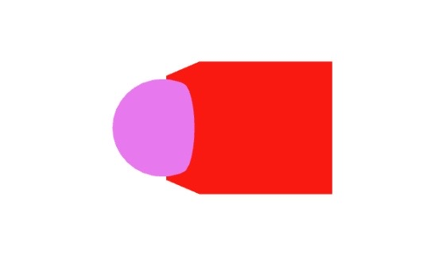

# Distance-based Input Device

The previous sections demonstrated interactions based on straight or curved pointers. However, in 3D environments, interactions often are based on distance, such as grab and touch interactions. In the following example, we show how we create a sphere distance-based input device using the `XSphereCollider` component and then control the input device's position using the "A" and "D" keys. The `XSphereCollider` interacts with the objects in the scene based on the provided `radius`. Once an object intersects the sphere's radius, the `onPointerEnter` is issued on the object. In the example, we add a red cube, which is scaled by the factor 1.2 when clicked. We also bind press and release events for the sphere to the enter key, which allows causing a `click` event on the red cube, by first moving the sphere inside the cube and then pressing and releasing "enter", just like grabbing with a controller.

[CodeSandbox](https://codesandbox.io/s/xinteraction-distance-th5p4n?file=/src/app.tsx)



```tsx
import { Canvas, useFrame } from "@react-three/fiber";
import {
  InputDeviceFunctions,
  XSphereCollider,
  noEvents,
} from "@coconut-xr/xinteraction/react";
import { useEffect, useMemo, useRef } from "react";
import { Mesh } from "three";

export default function App() {
  return (
    <Canvas events={noEvents}>
      <ColliderSphere id={-1} />
      <Box position={[2, 0, 0]} />
    </Canvas>
  );
}

function ColliderSphere({ id }: { id: number }) {
  const ref = useRef<Mesh>(null);
  const sphereRef = useRef<InputDeviceFunctions>(null);
  const keyPressMap = useMemo(() => new Set<string>(), []);
  useEffect(() => {
    const keyDown = (e: KeyboardEvent) => {
      if (e.key === "Enter") {
        sphereRef.current?.press(1, e);
      }
      keyPressMap.add(e.key);
    };
    const keyUp = (e: KeyboardEvent) => {
      if (e.key === "Enter") {
        sphereRef.current?.release(1, e);
      }
      keyPressMap.delete(e.key);
    };
    window.addEventListener("keydown", keyDown);
    window.addEventListener("keyup", keyUp);
    return () => {
      window.removeEventListener("keydown", keyDown);
      window.removeEventListener("keyup", keyUp);
    };
  }, []);
  useFrame((_, delta) => {
    if (ref.current == null) {
      return;
    }
    if (keyPressMap.has("a")) {
      ref.current.position.x -= delta * 1;
    }
    if (keyPressMap.has("d")) {
      ref.current.position.x += delta * 1;
    }
  });
  return (
    <mesh scale={0.5} ref={ref}>
      <sphereGeometry />
      <meshBasicMaterial color="violet" toneMapped={false} />
      <XSphereCollider ref={sphereRef} id={id} radius={0.5} />
    </mesh>
  );
}

function Box(props: any) {
  const ref = useRef<Mesh>(null);
  return (
    <mesh
      {...props}
      ref={ref}
      onClick={() => ref.current?.scale.multiplyScalar(1.2)}
    >
      <boxGeometry />
      <meshBasicMaterial color="red" toneMapped={false} />
    </mesh>
  );
}
```

# Touch

Instead or in addition to using events, such as pressing the enter key, to trigger events on input devices, it is also possible to issue press events when an object is at a certain distance from the input device. This, for instance, allows to create touch interactions. In the following, we modify the previous example by adding the `distanceElement` property to the `XSphereCollider` component. This property takes a `downRadius` and an `id`. The `downRadius` is the distance to the sphere center required for the input device to issue a press event, and the `id` represents the id of the input device element (button) that is pressed. Using the `distanceElement`, a touch interaction can be created. In the following example, moving the sphere in and out of the cube, a click event is caused on the cube.

_In some cases it might be necassary/convenient to statically set specific elements as pressed by default. This can be achieved by assigning a array of element ids to 'pressedElementIds'._

[CodeSandbox](https://codesandbox.io/s/xinteraction-touch-g5jv48?file=/src/app.tsx)


```tsx
import { Canvas, useFrame } from "@react-three/fiber";
import {
  InputDeviceFunctions,
  XSphereCollider,
  noEvents,
} from "@coconut-xr/xinteraction/react";
import { useEffect, useMemo, useRef } from "react";
import { Mesh } from "three";

export default function App() {
  return (
    <Canvas events={noEvents}>
      <ColliderSphere id={-1} />
      <Box position={[2, 0, 0]} />
    </Canvas>
  );
}

function ColliderSphere({ id }: { id: number }) {
  const ref = useRef<Mesh>(null);
  const sphereRef = useRef<InputDeviceFunctions>(null);
  const keyPressMap = useMemo(() => new Set<string>(), []);
  useEffect(() => {
    const keyDown = (e: KeyboardEvent) => {
      keyPressMap.add(e.key);
    };
    const keyUp = (e: KeyboardEvent) => {
      keyPressMap.delete(e.key);
    };
    window.addEventListener("keydown", keyDown);
    window.addEventListener("keyup", keyUp);
    return () => {
      window.removeEventListener("keydown", keyDown);
      window.removeEventListener("keyup", keyUp);
    };
  }, []);
  useFrame((_, delta) => {
    if (ref.current == null) {
      return;
    }
    if (keyPressMap.has("a")) {
      ref.current.position.x -= delta * 1;
    }
    if (keyPressMap.has("d")) {
      ref.current.position.x += delta * 1;
    }
  });
  return (
    <mesh scale={0.5} ref={ref}>
      <sphereGeometry />
      <meshBasicMaterial color="violet" toneMapped={false} />
      <XSphereCollider
        distanceElement={{ downRadius: 0.5, id: -1 }}
        ref={sphereRef}
        id={id}
        radius={0.5}
      />
    </mesh>
  );
}

function Box(props: any) {
    ...
}
```

In the next section, we introduce the event capture concept (in the web known as pointer capture) and show how to use event captures to build a dragging interaction.

<span style="font-size: 2rem">⤷ [Next Section](event-capture.md)</span>
