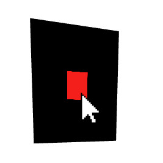

# Event Forwarding

In some scenarios, forwarding events from one scene to another is necessary. For instance, when creating a portal effect by rendering a separate scene onto a plane, the events occurring on the plane should be forwarded to the scene in the portal. Forwarding events for single pointers work in `R3F` without `xinteraction`. By using `xinteraction`, events from all input devices can be forwarded. **xinteraction** solves event forwarding using the `useForwardEvents` hook. When forwarding events from a mesh to a scene, the `useMeshForwardEvents` can be used. In some cases, forwarded events should not contain `click` events when a drag motion is detected. The `useMeshForwardEvents` hook provides a `dragDistance` parameter, which allows specifying the minimal distance at which `press` and `move` events are considered a drag.

In the following example, we will create a portal to a scene with an interactable box. We use the `useFBO` (use frame buffer object) from `drei` and a `createPortal` from `R3F`. The events occurring on the plane are forwarded to the scene in the frame buffer using the `useMeshForwardEvents` hook. The hook returns a set of event listeners that are attached to the plane.


[CodeSandbox](https://codesandbox.io/s/xinteraction-forward-events-xs9kt5?file=/src/app.tsx)



```tsx
import { Canvas, createPortal, useFrame } from "@react-three/fiber";
import { XWebPointers, noEvents, useMeshForwardEvents } from "@coconut-xr/xinteraction/react";
import { useMemo, useState } from "react";
import { useFBO } from "@react-three/drei";
import { Color, PerspectiveCamera, Scene } from "three";

export default function App() {
  return (
    <Canvas style={{ touchAction: "none" }} events={noEvents}>
      <Portal />
      <XWebPointers />
    </Canvas>
  );
}

function Portal() {
  const fbo = useFBO(1024, 1024);

  const scene = useMemo(() => {
    const scene = new Scene();
    scene.background = new Color("black");
    return scene;
  }, []);

  const cam = useMemo(() => new PerspectiveCamera(), []);

  useFrame((state) => {
    cam.position.z = 5;
    cam.position.x = 0;
    state.gl.setRenderTarget(fbo);
    state.gl.render(scene, cam);
    state.gl.setRenderTarget(null);
  });

  const props = useMeshForwardEvents(cam, scene, 0.05);

  return (
    <>
      {createPortal(<Box onClick={() => window.alert("click")} />, scene)}
      <mesh {...props}>
        <planeGeometry />
        <meshBasicMaterial map={fbo.texture} />
      </mesh>
    </>
  );
}

function Box(props) {
  const [hovered, setHovered] = useState<Array<number>>([]);
  return (
    <mesh
      onPointerEnter={(e) => {
        e.stopPropagation();
        setHovered((c) => [...c, e.pointerId]);
      }}
      onPointerLeave={(e) => {
        e.stopPropagation();
        setHovered((c) => c.filter((id) => id != e.pointerId));
      }}
      {...props}
    >
      <boxGeometry />
      <meshBasicMaterial
        color="red"
        opacity={1 - hovered.length * 0.3}
        transparent
        toneMapped={false}
      />
    </mesh>
  );
}

```