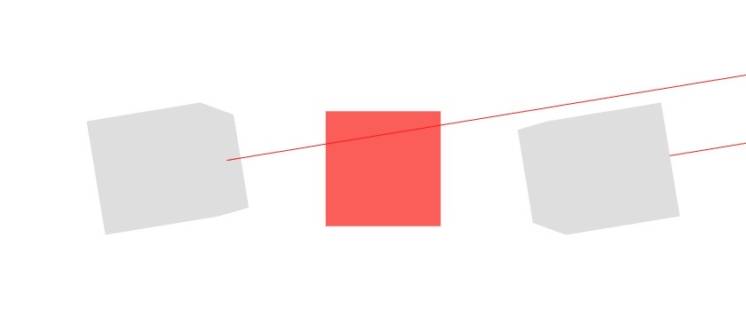
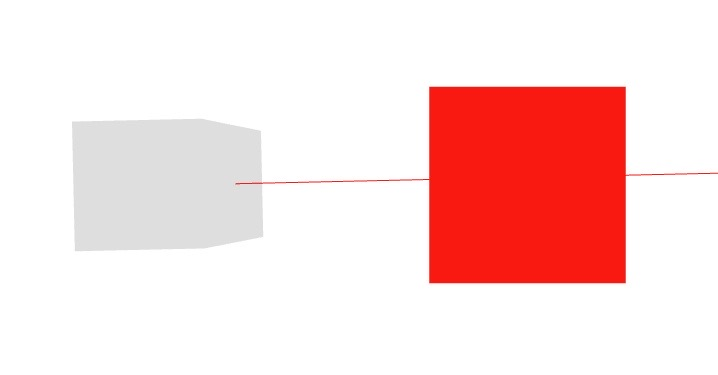

# Pointer

The flexibility of **xinteraction** can be seen when adding more input devices, such as simple pointers. In the following example, we will define a `RotatatingPointer`, which simply rotates around and causes `onPointerEnter` and `onPointerLeave` events on the `Box` using our `XStraightPointer` component. We add two of those `RotatatingPointer` at different positions in the scene. Both pointers need different ids to differentiate them from each other. To differentiate the pointers from touch and mouse events, we encourage negative pointerIds.

[CodeSandbox](https://codesandbox.io/s/xinteraction-pointer-f7rq5n?file=/src/app.tsx)



```tsx
import { Canvas, useFrame } from "@react-three/fiber";
import { XWebPointers, XStraightPointer } from "@coconut-xr/xinteraction/react";
import { useRef, useState } from "react";
import { BufferGeometry, Mesh, Vector3, Vector3Tuple } from "three";

export default function App() {
  return (
    <Canvas
      style={{ touchAction: "none" }}
      events={() => ({
        enabled: false,
        priority: 0
      })}
    >
      <Box />
      <XWebPointers />
      <RotatatingPointer id={-1} position={[-2, 0, 0]} />
      <RotatatingPointer id={-2} position={[2, 0, 0]} />
    </Canvas>
  );
}

const lineGeometry = new BufferGeometry().setFromPoints([
  new Vector3(),
  new Vector3(0, 0, 100)
]);

function RotatatingPointer({
  id,
  ...props
}: {
  id: number;
  position?: Vector3Tuple;
}) {
  const ref = useRef<Mesh>(null);
  useFrame((_, delta) => {
    if (ref.current == null) {
      return;
    }
    ref.current.rotation.x += delta * 1;
  });
  return (
    <mesh rotation-order="ZYX" rotation-y={Math.PI / 2} {...props} ref={ref}>
      <boxGeometry />
      <XStraightPointer id={id} />
      <lineSegments geometry={lineGeometry}>
        <lineBasicMaterial color="red" toneMapped={false} />
      </lineSegments>
    </mesh>
  );
}

function Box() {
    ...
}
```

## Pressing, Releasing, and Clicking Pointer

The `RotatatingPointer` from the previous example only hovers the box. In this example, we will make the `RotatatingPointer` click the box. We can cause `press`, `release`, `wheel`, and `cancel` events by retrieving a reference to the `XStraightPointer`. In this case, we will connect the `press` and `release` events to the key press and release events of the keyboard. Each time a key is pressed down, we call `pointer.press(1, event)`. The first parameter represents the button/input-device-element that is pressed and is any arbitrary number. For instance, by web standards, the button number "0" represents the left mouse button. An input device can have arbitrarily many input-device elements, which can be independently pressed and released. On the `Box` component, we add a `click` listener, which causes the box to scale by factor 1.2.

[CodeSandbox](https://codesandbox.io/s/xinteraction-pointer-click-tz3rp9?file=/src/app.tsx)



```tsx
import { Canvas, useFrame } from "@react-three/fiber";
import {
  XWebPointers,
  InputDeviceFunctions,
  XStraightPointer
} from "@coconut-xr/xinteraction/react";
import { useEffect, useRef, useState } from "react";
import { BufferGeometry, Mesh, Vector3, Vector3Tuple } from "three";

export default function App() {
  return (
    <Canvas
      events={() => ({
        enabled: false,
        priority: 0
      })}
    >
      <Box />
      <XWebPointers />
      <RotatatingPointer id={-1} position={[-3, 0, 0]} />
    </Canvas>
  );
}

const lineGeometry = new BufferGeometry().setFromPoints([
  new Vector3(),
  new Vector3(0, 0, 100)
]);

function RotatatingPointer({
  id,
  ...props
}: {
  id: number;
  position?: Vector3Tuple;
}) {
  const ref = useRef<Mesh>(null);
  const pointerRef = useRef<InputDeviceFunctions>(null);
  useFrame((_, delta) => {
    if (ref.current == null) {
      return;
    }
    ref.current.rotation.x += delta * 1;
  });
  useEffect(() => {
    if (pointerRef.current == null) {
      return;
    }
    const press = (e) => pointerRef.current.press(1, e);
    const release = (e) => pointerRef.current.release(1, e);

    window.addEventListener("keydown", press);
    window.addEventListener("keyup", release);
    return () => {
      window.removeEventListener("keydown", press);
      window.removeEventListener("keyup", release);
    };
  }, []);
  return (
    <mesh rotation-order="ZYX" rotation-y={Math.PI / 2} {...props} ref={ref}>
      <boxGeometry />
      <XStraightPointer ref={pointerRef} id={id} />
      <lineSegments geometry={lineGeometry}>
        <lineBasicMaterial color="red" toneMapped={false} />
      </lineSegments>
    </mesh>
  );
}

function Box() {
  const ref = useRef<Mesh>(null);
  return (
    <mesh ref={ref} onClick={() => ref.current?.scale.multiplyScalar(1.2)}>
      <boxGeometry />
      <meshBasicMaterial color="red" toneMapped={false} />
    </mesh>
  );
}

```

Sometimes, a straight pointer is insufficient, and a curved pointer is necessary. In the next section, we introduce the **curved pointer**, which can be, for instance, used to create a teleport interaction with the ground.


<span style="font-size: 2rem">⤷ [Next Section](curved.md)</span>