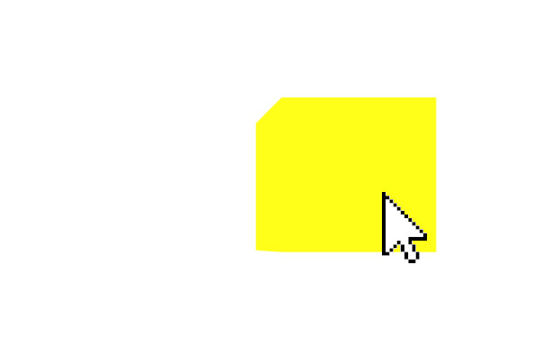

# Event Capture

**xinteraction** allows to capture the events of a pointer to an object. In R3F we can use `event.target.setPointerCapture(e.pointerId)` for capturing all subsequent events to the intersected object. Capturing the events is important for implementing interactions, such as dragging, since it causes the events to the same object event when this object is not intersected anymore until the capture is released or the input device issues a release event.

In the following example, we show how to build a dragging interaction. Because of **xinteraction** the follwing code works with any arbitrary input device and therefore also in WebXR.

Once the mesh in the `DragCube` receives a `onPointerDown` event, we use `setPointerCapture` to capture the subequent events and set the `downState`, which contains the initial offset between the intersection `point`. For every `onPointerMove` event, we can then calculate the new position by summing the current position of the intersection `point` with the initial offset. Every time the `onPointerLeave` or `onPointerUp` events are called, the `downState` is reset, terminating the drag interaction.

[CodeSandbox](https://codesandbox.io/s/xinteraction-drag-7t6wdx?file=/src/app.tsx)



```tsx
import { Canvas } from "@react-three/fiber";
import { XWebPointers } from "@coconut-xr/xinteraction/react";
import { useRef } from "react";
import { Mesh, Quaternion, Vector3 } from "three";
import { isXIntersection } from "@coconut-xr/xinteraction";

export default function App() {
  return (
    <Canvas
      events={() => ({
        enabled: false,
        priority: 0
      })}
    >
      <XWebPointers />
      <DragCube />
    </Canvas>
  );
}

function DragCube() {
  const ref = useRef<Mesh>(null);
  const downState = useRef<{
    pointerId: number;
    pointToObjectOffset: Vector3;
  }>();
  return (
    <mesh
      onPointerDown={(e) => {
        if (
          ref.current != null &&
          downState.current == null &&
          isXIntersection(e)
        ) {
          e.stopPropagation();
          (e.target as HTMLElement).setPointerCapture(e.pointerId);
          downState.current = {
            pointerId: e.pointerId,
            pointToObjectOffset: ref.current.position.clone().sub(e.point)
          };
        }
      }}
      onPointerUp={(e) => {
        if (downState.current?.pointerId == e.pointerId) {
          downState.current = undefined;
        }
      }}
      onPointerLeave={(e) => {
        if (downState.current?.pointerId == e.pointerId) {
          downState.current = undefined;
        }
      }}
      onPointerMove={(e) => {
        if (
          ref.current == null ||
          downState.current == null ||
          e.pointerId != downState.current.pointerId ||
          !isXIntersection(e)
        ) {
          return;
        }

        ref.current.position
          .copy(downState.current.pointToObjectOffset)
          .add(e.point);
      }}
      ref={ref}
    >
      <boxGeometry />
      <meshBasicMaterial color="yellow" toneMapped={false} />
    </mesh>
  );
}
```
