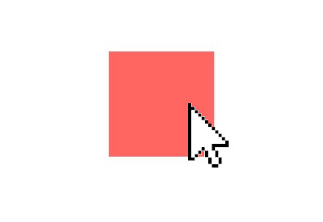

## **xinteraction** Concept

**xinteraction** provides the means to integrate different input devices, such as a WebXR Controllers and a mouse, consistently into a 3D scene. **xinteraction** provides a simple interface to the input devices, and translates their events into objects in a Three.js scene.

**xinteraction** allows to define how an object reacts to interaction indepedent from the specific input device. For instance, when building the logic for dragging a 3D cube, **xinteraction** allows to use familar functionaly such as `setPointerCapture`, and familar events such as `onPointerDown` and `onPointerUp` to describe the dragging behavior. As a result, the cube is draggable using a mouse, touch controls, 6DOF Controllers, Hands, and all other input devices added to the scene.

**xinteraction** provides only very primitive input devices, which can be composed for more complex interactions, like touch interaction using the index finger of WebXR Hands. For more high level WebXR input devices, visit [TBD]().

## Getting Started

In the following tutorials, we will introduce how to add input devices and interactive objects to a scene in react using react-three/fiber. To follow along in our own development environment install the dependencies via `npm i @coconut-xr/xinteraction @react-three/fiber react react-dom three` or use the CodeSandbox provided for each example.

## Mouse and Touch Interaction

At first, we will remove the default event handling of @react-three/fiber. This is achieved by providing a function to the `events` property of the `Canvas` that disables the event system. In order to renable interaction via the mouse and touch, we will add corresponding **xinteraction** input devices. We provide the `XWebPointers` component, which automatically creates a input device for the mouse and one for each touch pointer. With these 2 changes we already enabled the scene to handle multiple input devices and multi-touch. The following code shows a `Box`, which decreases its opacity when more input devices (e.g. fingers on a touch screen) are over it.

[CodeSandbox](https://codesandbox.io/s/xinteraction-introduction-6848g2?file=/src/app.tsx)



```tsx
import { Canvas } from "@react-three/fiber";
import { XWebPointers } from "@coconut-xr/xinteraction/react";
import { useState } from "react";

export default function App() {
  return (
    <Canvas
      events={() => ({
        enabled: false,
        priority: 0,
      })}
    >
      <Box />
      <XWebPointers />
    </Canvas>
  );
}

function Box() {
  const [hovered, setHovered] = useState<Array<number>>([]);
  return (
    <mesh
      onPointerEnter={(e) => {
        e.stopPropagation();
        setHovered((c) => [...c, e.pointerId]);
      }}
      onPointerLeave={(e) => {
        e.stopPropagation();
        setHovered((c) => c.filter((id) => id != e.pointerId));
      }}
    >
      <boxGeometry />
      <meshBasicMaterial
        color="red"
        opacity={1 - hovered.length * 0.3}
        transparent
        toneMapped={false}
      />
    </mesh>
  );
}
```

Multi-touch support is nice, but that's not what we are hear for. In the next section, we introduce how to create **arbitrary pointers**, that can, for instance, be attached to XRControllers.

<span style="font-size: 2rem">⤷ [Next Section](pointing.md)</span>
